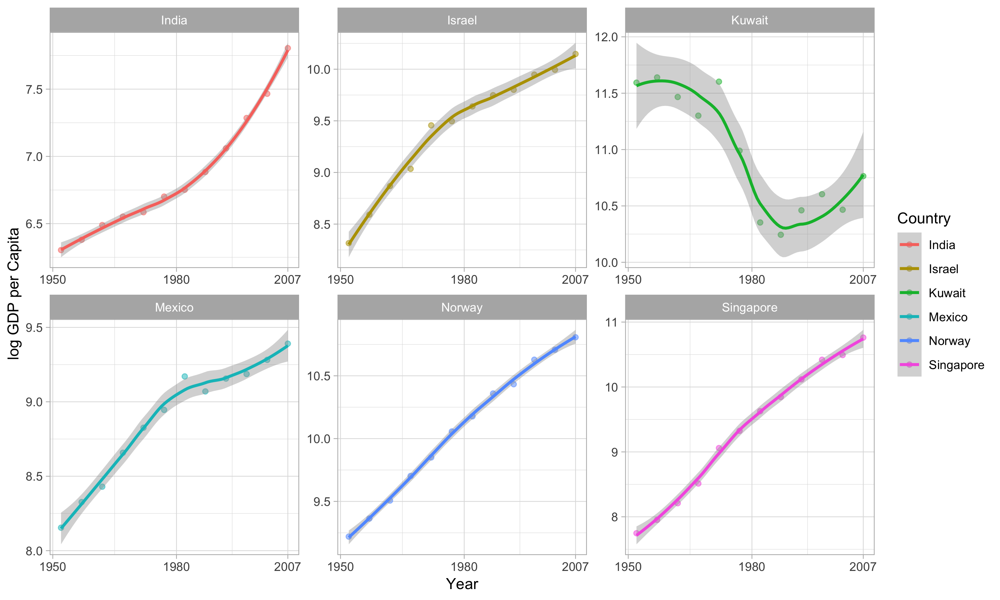

```{r}
suppressPackageStartupMessages(library(tidyverse))
library(gapminder)
library(broom)
library(ggplot2)
library(knitr)
library(kableExtra)
library(forcats)
library(scales)
```

##Part 1 - Factor Management

```{r}
str(gapminder)
```
Firtsly, we use the str() function, and observe that the country and continent features are factors. We also see that there are 142 levels for country, and 5 levels for continent (as expected). There are 1704 observations (rows). 

Lets drop Oceania from the set, and remove the unused factor associated with Oceania.

```{r}
gapminder %>%
  filter(continent != 'Oceania') %>%
  droplevels() %>%
  str()
```

Now, the number of rows is reduced to 1680, and there are 140 levels for the factor country and 4 levels for continent. 

##Part 2 - File I/O

Here we create a summary statistic showing the difference in gdpPercap from 1957 to 2007 for all countries. 

```{r}
change <- gapminder %>%
  filter(year %in% c(1957, 2007)) %>%
  group_by(country) %>%
  summarise(gdpGrowt = diff(gdpPercap))
```

We filter out the values close to 0 (want to see the extremal values), drop levels and plot it:

```{r}
change_small <- change %>%
  filter(abs(gdpGrowt) > 15000) %>%
  droplevels()

change_small %>%
  ggplot(aes(gdpGrowt, country)) + geom_point()
```

Now, lets sort it so that we can see the plot in ascending order:

```{r}
change_small_sorted <- change_small %>%
  mutate(country = fct_reorder(country, gdpGrowt))

change_small_sorted %>%
  ggplot(aes(gdpGrowt, country)) + geom_point()
```
Thats a lot better!

Write to csv, and read:

```{r}
write_csv(change_small_sorted, "GdpPercap_change.csv")
from_file <- read_csv("GdpPercap_change.csv")
```
And now we can check if the dataframe kept the sorting, after being transformed to csv and back to R-dataframe:

```{r}
from_file %>%
  ggplot(aes(gdpGrowt, country)) + geom_point()
```

Ups, it does not :S This should be remembered!

##Part 3 - Vizualisation Design

Lets dig deeper into the growt in gdpPercap for some specific countries.

```{r}
change_few <- gapminder %>%
  filter(country %in% c('Norway', 'Kuwait', 'Singapore', 'Israel', 'India', 'Mexico'))

change_few %>%
  ggplot(aes(year, gdpPercap, color = country)) +
  geom_point() +
  geom_smooth() +
  facet_wrap(~country, scales = "free")
```

This looks nice. Remember, det scales are set to free, so one should be careful comparing the results!

Now lets see if we can improve the plot.

```{r}
best_plot <- change_few %>%
  rename(Country = country) %>%
  
  ggplot(aes(year, log(gdpPercap), color = Country)) +
  geom_point(alpha = 0.5) +
  geom_smooth(method = 'auto') +
  facet_wrap(~Country, scales = "free") +

  ylab("log GDP per Capita") +
  xlab("Year") +
  
  scale_x_continuous(breaks = c(1950, 1980, 2007)) +
  scale_y_continuous() +

  theme_light()
```

With the plotly library you can make interactive plots. This does not work so well in R-markdown, however, so I will not include it here. 


##Part 4 - Writing Figures to File

Here I will save the above plot to file as png. The plots can also be saved as i.e. pdf-format. 

```{r}
ggsave("gdpGrowt.png", width = 10, height = 6, dpi="retina")
```

I could potentially also have chosen to save one of the earlier plots.

And finally, I'll include the plot in the document, loaded from file. 


