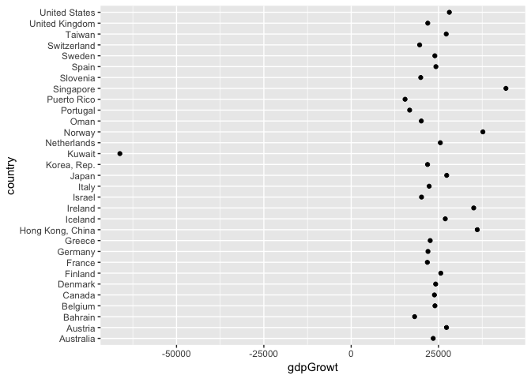
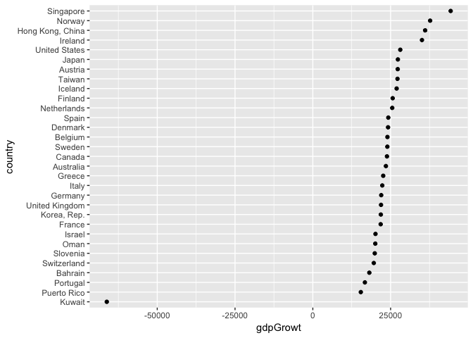
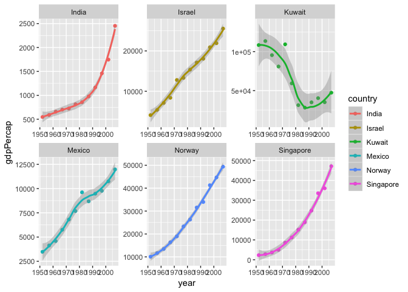
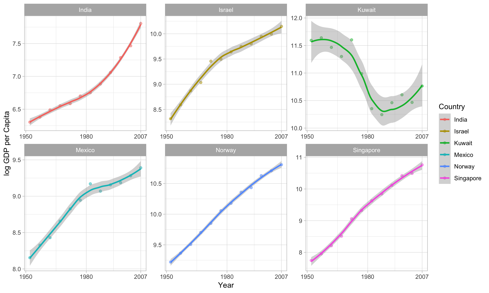

R Notebook
================

``` r
suppressPackageStartupMessages(library(tidyverse))
```

    ## Warning: package 'ggplot2' was built under R version 3.4.4

``` r
library(gapminder)
library(broom)
```

    ## Warning: package 'broom' was built under R version 3.4.4

``` r
library(ggplot2)
library(knitr)
library(kableExtra)
```

    ## Warning: package 'kableExtra' was built under R version 3.4.4

``` r
library(forcats)
library(scales)
```

    ## 
    ## Attaching package: 'scales'

    ## The following object is masked from 'package:purrr':
    ## 
    ##     discard

    ## The following object is masked from 'package:readr':
    ## 
    ##     col_factor

Part 1 - Factor Management
--------------------------

``` r
str(gapminder)
```

    ## Classes 'tbl_df', 'tbl' and 'data.frame':    1704 obs. of  6 variables:
    ##  $ country  : Factor w/ 142 levels "Afghanistan",..: 1 1 1 1 1 1 1 1 1 1 ...
    ##  $ continent: Factor w/ 5 levels "Africa","Americas",..: 3 3 3 3 3 3 3 3 3 3 ...
    ##  $ year     : int  1952 1957 1962 1967 1972 1977 1982 1987 1992 1997 ...
    ##  $ lifeExp  : num  28.8 30.3 32 34 36.1 ...
    ##  $ pop      : int  8425333 9240934 10267083 11537966 13079460 14880372 12881816 13867957 16317921 22227415 ...
    ##  $ gdpPercap: num  779 821 853 836 740 ...

Firtsly, we use the str() function, and observe that the country and continent features are factors. We also see that there are 142 levels for country, and 5 levels for continent (as expected). There are 1704 observations (rows).

Lets drop Oceania from the set, and remove the unused factor associated with Oceania.

``` r
gapminder %>%
  filter(continent != 'Oceania') %>%
  droplevels() %>%
  str()
```

    ## Warning: package 'bindrcpp' was built under R version 3.4.4

    ## Classes 'tbl_df', 'tbl' and 'data.frame':    1680 obs. of  6 variables:
    ##  $ country  : Factor w/ 140 levels "Afghanistan",..: 1 1 1 1 1 1 1 1 1 1 ...
    ##  $ continent: Factor w/ 4 levels "Africa","Americas",..: 3 3 3 3 3 3 3 3 3 3 ...
    ##  $ year     : int  1952 1957 1962 1967 1972 1977 1982 1987 1992 1997 ...
    ##  $ lifeExp  : num  28.8 30.3 32 34 36.1 ...
    ##  $ pop      : int  8425333 9240934 10267083 11537966 13079460 14880372 12881816 13867957 16317921 22227415 ...
    ##  $ gdpPercap: num  779 821 853 836 740 ...

Now, the number of rows is reduced to 1680, and there are 140 levels for the factor country and 4 levels for continent.

Part 2 - File I/O
-----------------

Here we create a summary statistic showing the difference in gdpPercap from 1957 to 2007 for all countries.

``` r
change <- gapminder %>%
  filter(year %in% c(1957, 2007)) %>%
  group_by(country) %>%
  summarise(gdpGrowt = diff(gdpPercap))
```

We filter out the values close to 0 (want to see the extremal values), drop levels and plot it:

``` r
change_small <- change %>%
  filter(abs(gdpGrowt) > 15000) %>%
  droplevels()

change_small %>%
  ggplot(aes(gdpGrowt, country)) + geom_point()
```



Now, lets sort it so that we can see the plot in ascending order:

``` r
change_small_sorted <- change_small %>%
  mutate(country = fct_reorder(country, gdpGrowt))

change_small_sorted %>%
  ggplot(aes(gdpGrowt, country)) + geom_point()
```

 Thats a lot better!

Write to csv, and read:

``` r
write_csv(change_small_sorted, "GdpPercap_change.csv")
from_file <- read_csv("GdpPercap_change.csv")
```

    ## Parsed with column specification:
    ## cols(
    ##   country = col_character(),
    ##   gdpGrowt = col_double()
    ## )

And now we can check if the dataframe kept the sorting, after being transformed to csv and back to R-dataframe:

``` r
from_file %>%
  ggplot(aes(gdpGrowt, country)) + geom_point()
```


Ups, it does not :S This should be remembered!

Part 3 - Vizualisation Design
-----------------------------

Lets dig deeper into the growt in gdpPercap for some specific countries.

``` r
change_few <- gapminder %>%
  filter(country %in% c('Norway', 'Kuwait', 'Singapore', 'Israel', 'India', 'Mexico'))

change_few %>%
  ggplot(aes(year, gdpPercap, color = country)) +
  geom_point() +
  geom_smooth() +
  facet_wrap(~country, scales = "free")
```

    ## `geom_smooth()` using method = 'loess' and formula 'y ~ x'



This looks nice. Remember, det scales are set to free, so one should be careful comparing the results!

Now lets see if we can improve the plot.

``` r
best_plot <- change_few %>%
  rename(Country = country) %>%
  
  ggplot(aes(year, log(gdpPercap), color = Country)) +
  geom_point(alpha = 0.5) +
  geom_smooth(method = 'auto') +
  facet_wrap(~Country, scales = "free") +

  ylab("log GDP per Capita") +
  xlab("Year") +
  
  scale_x_continuous(breaks = c(1950, 1980, 2007)) +
  scale_y_continuous() +

  theme_light()

best_plot
```

    ## `geom_smooth()` using method = 'loess' and formula 'y ~ x'


Part 4 - Writing Figures to File
--------------------------------

``` r
ggsave("ggplot_gdpGrowt.png", width = 10, height = 6, dpi="retina")
```

    ## `geom_smooth()` using method = 'loess' and formula 'y ~ x'


